# DCCA Salesforce Data Model

Generated 2026-10-05 from `force-app/main/default/objects` (233 objects, 418 relationship fields) plus a read-only describe of Account, Contact, Case and pymt__PaymentX__c from the DCCA sandbox. Interactive version: `10-data-model.html`.

Legend: solid line = master-detail, dashed = lookup. Lookups to User are omitted. `CodeRefs` = non-test Apex + LWC/Aura + Flow files referencing the object.

## Domain overview

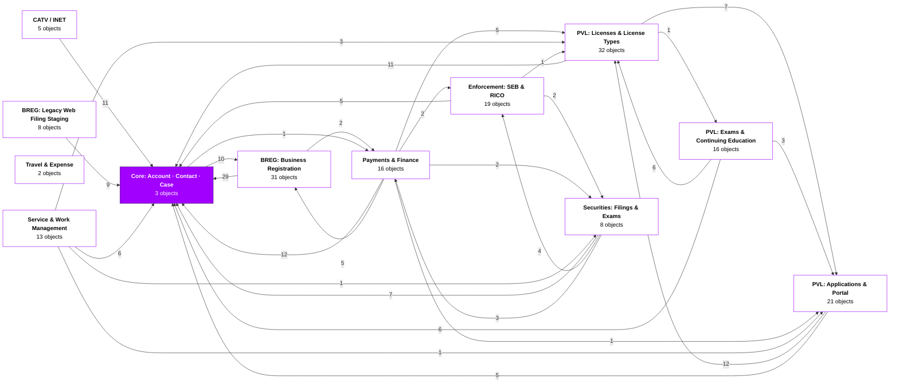

## Core: Account · Contact · Case (3 objects)

Shared CRM backbone used by every division.

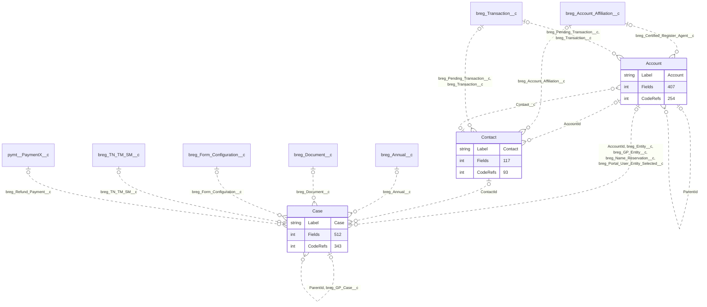

## BREG: Business Registration (31 objects)

Entities, filings, transactions, annuals, certificates and documents for the Business Registration Division.

```mermaid
erDiagram
    Account |o..o{ breg_Account_Affiliation__c : "breg_Account__c, breg_Entity__c"
    Account |o..o{ breg_Acquisition_Transaction__c : "breg_Merged_Entity__c"
    Account |o..o{ breg_Annual__c : "breg_Account__c"
    Account |o..o{ breg_Certificate__c : "breg_Account__c"
    Account |o..o{ breg_Document__c : "breg_Account__c"
    Account |o..o{ breg_Log__c : "breg_Account__c"
    Account |o..o{ breg_Notification__c : "breg_Account__c"
    Account |o..o{ breg_Stock__c : "breg_Account__c"
    Account |o..o{ breg_TN_TM_SM__c : "breg_Account__c"
    Account |o..o{ breg_Test_Annual__c : "breg_Account__c"
    Account |o..o{ breg_Transaction_Address__c : "breg_Account__c"
    Account |o..o{ breg_Transaction_Business_Info__c : "breg_Entity__c"
    Account |o..o{ breg_Transaction__c : "breg_Account__c"
    Case |o..o{ breg_Account_Affiliation__c : "breg_Case__c"
    Case |o..o{ breg_Annual__c : "breg_Case__c"
    Case |o..o{ breg_Case_Staging__c : "breg_Case__c"
    Case |o..o{ breg_Document__c : "breg_Case__c"
    Case |o..o{ breg_Log__c : "breg_Case__c"
    Case |o..o{ breg_RDPMS_Adhoc_Request__c : "breg_Case__c"
    Case |o..o{ breg_Search_Log__c : "breg_Case__c"
    Case |o..o{ breg_Stock__c : "breg_Case__c"
    Case |o..o{ breg_TN_TM_SM__c : "breg_Last_Renewal_Case__c"
    Case |o..o{ breg_Test_Annual__c : "breg_Case__c"
    Case |o..o{ breg_Transaction__c : "breg_Case__c, breg_File_Number__c"
    CashierCode__c |o..o{ breg_Notification__c : "breg_Cashier_Code__c"
    Contact |o..o{ breg_Account_Affiliation__c : "breg_Contact__c"
    Contact |o..o{ breg_Entity_List_Result__c : "breg_Contact__c"
    Contact |o..o{ breg_Notification__c : "breg_Contact__c"
    Transaction__c |o..o{ breg_Transaction_Business_Info__c : "breg_Pending_Transaction__c"
    breg_Account_Affiliation__c |o..o{ breg_Account_Affiliation__c : "breg_Previous_Account_Affiliation__c"
    breg_Account_Affiliation__c |o..o{ breg_Transaction_Address__c : "breg_Account_Affiliation__c"
    breg_Agent_Search_List__c ||--o{ breg_Agent_Search_Result__c : "breg_Agent_Search_List__c"
    breg_Annual__c |o..o{ breg_Document__c : "breg_Annual__c"
    breg_Certificate__c |o..o{ breg_Acquisition_Transaction__c : "breg_Certificate__c"
    breg_Certificate__c |o..o{ breg_Certificate__c : "breg_Parent_Certificate__c"
    breg_Certificate__c |o..o{ breg_TN_TM_SM__c : "breg_Certificate__c"
    breg_Certificate__c |o..o{ breg_Transaction__c : "breg_Certificate__c"
    breg_Document__c |o..o{ breg_Case_Staging__c : "breg_Document__c"
    breg_Document__c |o..o{ breg_Certificate__c : "breg_Document__c"
    breg_Document__c |o..o{ breg_Document__c : "breg_Template_Document__c"
    breg_Document__c |o..o{ breg_RDPMS_Adhoc_Request__c : "breg_Document__c"
    breg_Entity_List__c ||--o{ breg_Entity_List_Item__c : "breg_Entity_List__c"
    breg_Entity_List__c ||--o{ breg_Entity_List_Result__c : "breg_Entity_List__c"
    breg_Fee__c |o..o{ breg_Notification__c : "breg_Fee__c"
    breg_Form_Configuration_Item__c |o..o{ breg_Document__c : "breg_Form_Configuration_Item__c"
    breg_Form_Configuration__c |o..o{ breg_Fee__c : "breg_Form_Configuration__c"
    breg_Form_Configuration__c ||--o{ breg_Form_Configuration_Item__c : "breg_Form_Configuration__c"
    breg_Form_Configuration__c |o..o{ breg_Form_Configuration__c : "breg_Linked_Form__c"
    breg_Form_Configuration__c |o..o{ breg_Transaction__c : "breg_Form_Configuration__c"
    breg_RDPMS_Adhoc_Request__c |o..o{ breg_Document__c : "breg_RDPMS_Adhoc_Request__c"
    breg_TN_TM_SM__c |o..o{ breg_Account_Affiliation__c : "breg_TN_TM_SM__c"
    breg_TN_TM_SM__c |o..o{ breg_Document__c : "breg_TN_TM_SM__c"
    breg_TN_TM_SM__c |o..o{ breg_Notification__c : "breg_TN_TM_SM__c"
    breg_TN_TM_SM__c |o..o{ breg_Transaction_Address__c : "breg_TN_TM_SM__c"
    breg_TN_TM_SM__c |o..o{ breg_Transaction__c : "breg_TN_TM_SM__c"
    breg_Transaction__c |o..o{ breg_Account_Affiliation__c : "breg_Transaction__c, breg_Pending_Transaction__c"
    breg_Transaction__c |o..o{ breg_Acquisition_Transaction__c : "breg_Transaction__c"
    breg_Transaction__c |o..o{ breg_Annual__c : "BREG_Transaction__c"
    breg_Transaction__c |o..o{ breg_BRIM_Transaction_Event__b : "breg_Transaction__c"
    breg_Transaction__c |o..o{ breg_Document__c : "breg_Transaction__c"
    breg_Transaction__c |o..o{ breg_Stock__c : "breg_Transaction__c, breg_Pending_Transaction__c"
    breg_Transaction__c |o..o{ breg_TN_TM_SM__c : "breg_Transaction__c, Pending_Transaction__c"
    breg_Transaction__c |o..o{ breg_Test_Annual__c : "BREG_Transaction__c"
    breg_Transaction__c ||--o{ breg_Transaction_Address__c : "BREG_Transaction__c, BREG_Pending_Transaction__c"
    breg_Transaction__c |o..o{ breg_Transaction_Business_Info__c : "breg_Transaction__c"
    breg_Transaction__c |o..o{ breg_Transaction__c : "breg_Pending_Transaction__c"
    dsfs__DocuSign_Envelope_Document__c |o..o{ breg_TN_TM_SM__c : "breg_DocuSign_Envelope_Document__c"
    BREG_ADDRESS_PROTECTION__c {
        string Label "ADDRESS PROTECTION"
        int Fields "6"
        int CodeRefs "1"
    }
    BREG_File_Number_Sequence__c {
        string Label "BREG File Number Sequence"
        int Fields "2"
        int CodeRefs "1"
    }
    breg_Account_Affiliation__c {
        string Label "Account Affiliation"
        int Fields "53"
        int CodeRefs "55"
    }
    breg_Acquisition_Transaction__c {
        string Label "Acquisition Transaction"
        int Fields "11"
        int CodeRefs "0"
    }
    breg_Agent_Search_List__c {
        string Label "Agent Search List"
        int Fields "9"
        int CodeRefs "5"
    }
    breg_Agent_Search_Result__c {
        string Label "Agent Search Result"
        int Fields "4"
        int CodeRefs "1"
    }
    breg_Annual__c {
        string Label "Annual"
        int Fields "26"
        int CodeRefs "36"
    }
    breg_BRIM_Transaction_Event__b {
        string Label "Transaction Event"
        int Fields "9"
        int CodeRefs "0"
    }
    breg_Batch_Job_Execution__c {
        string Label "Batch Job Execution"
        int Fields "16"
        int CodeRefs "8"
    }
    breg_Case_Staging__c {
        string Label "Case Staging"
        int Fields "12"
        int CodeRefs "3"
    }
    breg_Certificate__c {
        string Label "Certificate"
        int Fields "17"
        int CodeRefs "8"
    }
    breg_DBEDT_Report__c {
        string Label "DBEDT Report"
        int Fields "8"
        int CodeRefs "1"
    }
    breg_Document__c {
        string Label "Document"
        int Fields "32"
        int CodeRefs "30"
    }
    breg_Email_Log__c {
        string Label "Email Log"
        int Fields "3"
        int CodeRefs "2"
    }
    breg_Entity_List_Item__c {
        string Label "Entity List Item"
        int Fields "1"
        int CodeRefs "0"
    }
    breg_Entity_List_Result__c {
        string Label "Entity List Result"
        int Fields "8"
        int CodeRefs "5"
    }
    breg_Entity_List__c {
        string Label "Entity List"
        int Fields "14"
        int CodeRefs "6"
    }
    breg_Fee__c {
        string Label "Fee"
        int Fields "18"
        int CodeRefs "8"
    }
    breg_Form_Configuration_Item__c {
        string Label "Form Configuration Item"
        int Fields "16"
        int CodeRefs "5"
    }
    breg_Form_Configuration__c {
        string Label "Form Configuration"
        int Fields "36"
        int CodeRefs "27"
    }
    breg_Log__c {
        string Label "Log"
        int Fields "16"
        int CodeRefs "3"
    }
    breg_Notification__c {
        string Label "Notification"
        int Fields "14"
        int CodeRefs "7"
    }
    breg_RDPMS_Adhoc_Request__c {
        string Label "RDPMS Adhoc Request"
        int Fields "6"
        int CodeRefs "3"
    }
    breg_Rejection_Reason__c {
        string Label "Rejection Reason"
        int Fields "4"
        int CodeRefs "1"
    }
    breg_Search_Log__c {
        string Label "BREG Search Log"
        int Fields "12"
        int CodeRefs "3"
    }
    breg_Stock__c {
        string Label "Stock"
        int Fields "21"
        int CodeRefs "20"
    }
    breg_TN_TM_SM__c {
        string Label "TN/TM/SM"
        int Fields "53"
        int CodeRefs "49"
    }
    breg_Test_Annual__c {
        string Label "Test Annual"
        int Fields "20"
        int CodeRefs "1"
    }
    breg_Transaction_Address__c {
        string Label "BREG Transaction Address"
        int Fields "19"
        int CodeRefs "5"
    }
    breg_Transaction_Business_Info__c {
        string Label "Transaction Business Info"
        int Fields "49"
        int CodeRefs "5"
    }
    breg_Transaction__c {
        string Label "BREG Transaction"
        int Fields "46"
        int CodeRefs "33"
    }
```

## BREG: Legacy Web Filing Staging (8 objects)

Staging tables that receive legacy RDPMS web filings before they are mapped onto a Case.

```mermaid
erDiagram
    Account |o..o{ breg_WEB_WEB_BUSINESS_INFO__c : "breg_Web_Entity__c"
    Case |o..o{ breg_WEB_WEB_ADDRESSES__c : "breg_WEB_Case__c"
    Case |o..o{ breg_WEB_WEB_BUSINESS_INFO__c : "breg_WEB_Case__c"
    Case |o..o{ breg_WEB_WEB_FILING_INFO__c : "breg_WEB_Case__c"
    Case |o..o{ breg_WEB_WEB_FILING_YEARS__c : "breg_WEB_Case__c"
    Case |o..o{ breg_WEB_WEB_PERSONS__c : "breg_WEB_Case__c"
    Case |o..o{ breg_WEB_WEB_RESUB__c : "breg_WEB_Case__c"
    Case |o..o{ breg_WEB_WEB_STOCKS__c : "breg_Web_Case__c"
    Case |o..o{ breg_WEB_WEB_TRADE_MARKS__c : "breg_WEB_Case__c"
    breg_WEB_WEB_ADDRESSES__c {
        string Label "WEB ADDRESSES"
        int Fields "23"
        int CodeRefs "2"
    }
    breg_WEB_WEB_BUSINESS_INFO__c {
        string Label "WEB BUSINESS INFO"
        int Fields "45"
        int CodeRefs "1"
    }
    breg_WEB_WEB_FILING_INFO__c {
        string Label "WEB FILING INFO"
        int Fields "37"
        int CodeRefs "8"
    }
    breg_WEB_WEB_FILING_YEARS__c {
        string Label "WEB FILING YEARS"
        int Fields "18"
        int CodeRefs "0"
    }
    breg_WEB_WEB_PERSONS__c {
        string Label "WEB PERSONS"
        int Fields "38"
        int CodeRefs "1"
    }
    breg_WEB_WEB_RESUB__c {
        string Label "WEB RESUB"
        int Fields "4"
        int CodeRefs "0"
    }
    breg_WEB_WEB_STOCKS__c {
        string Label "WEB STOCKS"
        int Fields "19"
        int CodeRefs "1"
    }
    breg_WEB_WEB_TRADE_MARKS__c {
        string Label "WEB TRADE MARKS"
        int Fields "26"
        int CodeRefs "1"
    }
```

## PVL: Applications & Portal (21 objects)

Professional & Vocational Licensing applications, draft/metadata-driven online forms and portal users.

```mermaid
erDiagram
    Account |o..o{ Application__c : "3 lookups"
    Account |o..o{ PVL_Portal_User__c : "Account__c"
    Account |o..o{ Partner_Officer__c : "Account__c"
    ApplicationRequirement__c |o..o{ ApplicationRequirement__c : "ParentApplicationRequirement__c"
    Application_Cache__c |o..o{ Application__c : "DraftApplication__c"
    Application_Cache__c ||--o{ Card_Cache__c : "Application_Cache__c"
    Application_Meta_Data__c |o..o{ Application_Cache__c : "Application_Meta_Data__c"
    Application_Meta_Data__c |o..o{ Card_Meta_Data__c : "Application_Meta_Data__c"
    Application__c |o..o{ AdditionalDependentAppsLicenses__c : "DependentApplication__c, Application__c"
    Application__c ||--o{ ApplicationClassifications__c : "Application__c"
    Application__c ||--o{ ApplicationRequirement__c : "Application__c"
    Application__c |o..o{ Application_Cache__c : "Duties_Reassessment_Application__c"
    Application__c |o..o{ Application__c : "DependentApplication__c"
    Application__c ||--o{ Education__c : "Application__c"
    Application__c |o..o{ IVR_Application_Status_Snapshot__c : "Application__c"
    Application__c |o..o{ OtherStateLicenses__c : "Application__c"
    Application__c ||--o{ Partner_Officer__c : "Application__c"
    BoardProgram__c |o..o{ PVL_Board_Assignment__c : "Board_Program__c"
    BoardProgram__c |o..o{ Requisition__c : "BoardProgram__c"
    Card_Meta_Data__c |o..o{ Card_Cache__c : "Card_Meta_Data__c"
    Card_Meta_Data__c |o..o{ Field_Meta_Data__c : "Card_Meta_Data__c"
    Classification__c ||--o{ ApplicationClassifications__c : "Classification__c"
    Field_Filter__c |o..o{ Field_Filter__c : "Parent_Field_Filter__c"
    Field_Meta_Data__c |o..o{ Field_Filter__c : "Affected_Field_Meta_Data__c"
    LicenseType__c |o..o{ ApplicationClassifications__c : "LicenseType__c"
    LicenseType__c |o..o{ Application__c : "LicenseType__c"
    LicenseType__c |o..o{ PVL_Board_Assignment__c : "License_Type__c"
    LicenseType__c |o..o{ Requisition__c : "LicenseType__c"
    License__c |o..o{ AdditionalDependentAppsLicenses__c : "DependentLicense__c"
    License__c |o..o{ Application__c : "3 lookups"
    PVL_Portal_User__c |o..o{ Application_Cache__c : "PVLPortalUser__c"
    PVL_Portal_User__c |o..o{ Application__c : "PVLPortalUser__c"
    PVL_Portal_User__c |o..o{ PVL_Portal_Persona__c : "PVLPortalUser__c"
    PVL_Portal__c |o..o{ PVL_Portal_Persona__c : "PVLPortal__c"
    Requirements__c |o..o{ ApplicationRequirement__c : "Requirement__c"
    AdditionalDependentAppsLicenses__c {
        string Label "Additional Dependent Apps / Licenses"
        int Fields "5"
        int CodeRefs "0"
    }
    ApplicationClassifications__c {
        string Label "Application Classifications"
        int Fields "12"
        int CodeRefs "26"
    }
    ApplicationRequirement__c {
        string Label "Application Requirement"
        int Fields "15"
        int CodeRefs "16"
    }
    Application_Cache__c {
        string Label "Draft Application"
        int Fields "26"
        int CodeRefs "17"
    }
    Application_Log__c {
        string Label "Application Log"
        int Fields "12"
        int CodeRefs "6"
    }
    Application_Meta_Data__c {
        string Label "Application Meta Data"
        int Fields "12"
        int CodeRefs "14"
    }
    Application__c {
        string Label "Application"
        int Fields "443"
        int CodeRefs "177"
    }
    ApprenticeApplicationCounter__c {
        string Label "Apprentice Application Counter"
        int Fields "2"
        int CodeRefs "1"
    }
    Card_Cache__c {
        string Label "Card Cache"
        int Fields "6"
        int CodeRefs "9"
    }
    Card_Meta_Data__c {
        string Label "Card Meta Data"
        int Fields "10"
        int CodeRefs "12"
    }
    Education__c {
        string Label "Education"
        int Fields "7"
        int CodeRefs "1"
    }
    Field_Filter__c {
        string Label "Field Filter"
        int Fields "14"
        int CodeRefs "6"
    }
    Field_Meta_Data__c {
        string Label "Field Meta Data"
        int Fields "48"
        int CodeRefs "17"
    }
    IVR_Application_Status_Snapshot__c {
        string Label "IVR Application Status Snapshot"
        int Fields "12"
        int CodeRefs "4"
    }
    OtherStateLicenses__c {
        string Label "Other State Licenses"
        int Fields "7"
        int CodeRefs "1"
    }
    PVL_Board_Assignment__c {
        string Label "Work Item Assignment"
        int Fields "8"
        int CodeRefs "3"
    }
    PVL_Portal_Persona__c {
        string Label "PVL Portal Persona"
        int Fields "2"
        int CodeRefs "0"
    }
    PVL_Portal_User__c {
        string Label "PVL Portal User"
        int Fields "22"
        int CodeRefs "12"
    }
    PVL_Portal__c {
        string Label "PVL Portal"
        int Fields "0"
        int CodeRefs "0"
    }
    Partner_Officer__c {
        string Label "Partner/Officer"
        int Fields "6"
        int CodeRefs "0"
    }
    Requisition__c {
        string Label "Requisition"
        int Fields "34"
        int CodeRefs "5"
    }
```

## PVL: Licenses & License Types (32 objects)

Issued licenses, license-type configuration, requirements, insurance/bonds and notifications.

```mermaid
erDiagram
    Account |o..o{ AccountName__c : "Account__c"
    Account |o..o{ Associated_Account__c : "Account__c"
    Account |o..o{ Express_Change_Broker_History__c : "Account__c"
    Account |o..o{ Inspections__c : "Facility__c"
    Account |o..o{ LicenseHistory__c : "Account__c"
    Account |o..o{ License__c : "Licensee__c, MedicalDentalDependencyProgram__c"
    Account |o..o{ Notification__c : "Account__c"
    Account |o..o{ PVL_Express_Change_Broker_Form__c : "3 lookups"
    Application_Meta_Data__c |o..o{ LicenseType__c : "OnlineApplicationTemplate__c"
    Application__c |o..o{ InsuranceBond__c : "Application__c"
    Application__c |o..o{ License__c : "Application__c"
    Application__c |o..o{ Notification__c : "Application__c"
    AssociatedLicense__c |o..o{ Express_Change_Broker_History__c : "Associated_License__c"
    AssociatedLicense__c |o..o{ PVL_Express_Change_Broker_Form__c : "Agent_Associated_License__c"
    BoardProgram__c |o..o{ LicenseNumberAssignments__c : "BoardProgram__c"
    BoardProgram__c |o..o{ LicenseType__c : "BoardProgram__c"
    CertificateRequest__c |o..o{ Notification__c : "CertificateRequest__c"
    Classification__c ||--o{ LicenseClassification__c : "Classification__c"
    Classification__c |o..o{ LicenseTypeRequirements__c : "Classification__c"
    DocGeneratorSettings__c |o..o{ DocGeneratorDataSource__c : "DocGeneratorSettings__c"
    DocGeneratorSettings__c |o..o{ LicenseType__c : "32 lookups"
    InsuranceBond__c |o..o{ InsurancePortalSubmission__c : "Insurance__c"
    LicenseConditions__c |o..o{ LicenseConditions__c : "LicenseCondition__c"
    LicenseRequirements__c |o..o{ LicenseRequirements__c : "ParentLicenseRequirement__c"
    LicenseType__c ||--o{ Classification__c : "LicenseType__c"
    LicenseType__c |o..o{ LicenseNumberAssignments__c : "LicenseType__c"
    LicenseType__c ||--o{ LicensePeriod__c : "LicenseType__c"
    LicenseType__c |o..o{ LicenseTypeRequirements__c : "LicenseType__c"
    LicenseType__c ||--o{ LicenseType_Required_CE__c : "LicenseType__c"
    LicenseType__c |o..o{ LicenseType__c : "4 lookups"
    LicenseType__c |o..o{ License__c : "LicenseType__c"
    LicenseType__c |o..o{ Notification__c : "LicenseType__c"
    License__c ||--o{ AssociatedLicense__c : "EntityLicense__c, EmployeeLicense__c"
    License__c |o..o{ Associated_Account__c : "License__c"
    License__c |o..o{ CertificateRequest__c : "License__c"
    License__c |o..o{ Express_Change_Broker_History__c : "License__c"
    License__c |o..o{ Inspections__c : "License__c"
    License__c ||--o{ InsuranceBond__c : "License__c"
    License__c |o..o{ InsurancePortalSubmission__c : "License__c"
    License__c ||--o{ LicenseClassification__c : "License__c"
    License__c ||--o{ LicenseConditions__c : "License__c"
    License__c |o..o{ LicenseHistory__c : "License__c"
    License__c |o..o{ LicenseName__c : "License__c"
    License__c |o..o{ LicenseRequirements__c : "License__c"
    License__c |o..o{ LicenseType__c : "DependentLicense__c"
    License__c |o..o{ License__c : "9 lookups"
    License__c |o..o{ MakeandSupplier__c : "SuppliesTo__c, Supplier__c"
    License__c |o..o{ Notification__c : "License__c"
    License__c |o..o{ PVL_Express_Change_Broker_Form__c : "5 lookups"
    License__c |o..o{ RenewalScanningResults__c : "License__c"
    License__c ||--o{ Suspense__c : "License__c"
    Notification__c |o..o{ Notification__c : "Parent__c"
    PVL_Express_Change_Broker_Form__c ||--o{ Express_Change_Broker_History__c : "Request__c"
    PVL_Portal_User__c |o..o{ InsurancePortalSubmission__c : "PVLPortalUser__c"
    PVL_Portal_User__c |o..o{ License__c : "PVL_Portal_User__c"
    PVL_Portal_User__c |o..o{ PVL_Express_Change_Broker_Form__c : "PVL_Portal_User__c"
    Requirements__c |o..o{ LicenseRequirements__c : "Requirement__c"
    Requirements__c |o..o{ LicenseTypeRequirements__c : "Requirement__c"
    Requirements__c |o..o{ Requirements__c : "ParentRequirement__c"
    Subject__c |o..o{ LicenseType_Required_CE__c : "Subject__c"
    AccountName__c {
        string Label "Account Name"
        int Fields "10"
        int CodeRefs "4"
    }
    AssociatedLicense__c {
        string Label "Associated License"
        int Fields "50"
        int CodeRefs "76"
    }
    Associated_Account__c {
        string Label "Associated Account"
        int Fields "23"
        int CodeRefs "1"
    }
    BoardProgram__c {
        string Label "Board / Program"
        int Fields "4"
        int CodeRefs "17"
    }
    BusinessAccountCounter__c {
        string Label "Business Account Counter"
        int Fields "2"
        int CodeRefs "2"
    }
    CertificateRequest__c {
        string Label "Certificate Request"
        int Fields "23"
        int CodeRefs "5"
    }
    Classification__c {
        string Label "Classification"
        int Fields "8"
        int CodeRefs "29"
    }
    DocGeneratorDataSource__c {
        string Label "Doc Generator Data Source"
        int Fields "9"
        int CodeRefs "4"
    }
    DocGeneratorSettings__c {
        string Label "Doc Generator Settings"
        int Fields "6"
        int CodeRefs "18"
    }
    Express_Change_Broker_History__c {
        string Label "Express Change Broker History"
        int Fields "6"
        int CodeRefs "2"
    }
    Inspections__c {
        string Label "Inspections"
        int Fields "5"
        int CodeRefs "0"
    }
    InsuranceBond__c {
        string Label "Insurance & Bond"
        int Fields "33"
        int CodeRefs "28"
    }
    InsurancePortalSubmission__c {
        string Label "Insurance Portal Submission"
        int Fields "36"
        int CodeRefs "5"
    }
    Insurer__c {
        string Label "Insurer"
        int Fields "4"
        int CodeRefs "0"
    }
    LicenseClassification__c {
        string Label "License Classification"
        int Fields "15"
        int CodeRefs "37"
    }
    LicenseConditions__c {
        string Label "License Condition"
        int Fields "8"
        int CodeRefs "8"
    }
    LicenseHistory__c {
        string Label "License History"
        int Fields "65"
        int CodeRefs "37"
    }
    LicenseName__c {
        string Label "License Name"
        int Fields "9"
        int CodeRefs "8"
    }
    LicenseNumberAssignments__c {
        string Label "License Number Assignments"
        int Fields "4"
        int CodeRefs "3"
    }
    LicensePeriod__c {
        string Label "License Period"
        int Fields "7"
        int CodeRefs "44"
    }
    LicenseRequirements__c {
        string Label "License Requirements"
        int Fields "10"
        int CodeRefs "10"
    }
    LicenseTypeMapping__c {
        string Label "License Type Mapping"
        int Fields "4"
        int CodeRefs "1"
    }
    LicenseTypeRequirements__c {
        string Label "License Type Requirement"
        int Fields "22"
        int CodeRefs "6"
    }
    LicenseType_Required_CE__c {
        string Label "License Type / Education Subjects"
        int Fields "5"
        int CodeRefs "1"
    }
    LicenseType__c {
        string Label "License Type"
        int Fields "245"
        int CodeRefs "98"
    }
    License__c {
        string Label "License"
        int Fields "501"
        int CodeRefs "194"
    }
    MakeandSupplier__c {
        string Label "Make and Supplier"
        int Fields "6"
        int CodeRefs "0"
    }
    Notification__c {
        string Label "Notification"
        int Fields "33"
        int CodeRefs "44"
    }
    PVL_Express_Change_Broker_Form__c {
        string Label "Express Change Broker"
        int Fields "41"
        int CodeRefs "3"
    }
    RenewalScanningResults__c {
        string Label "Renewal Scanning Results"
        int Fields "4"
        int CodeRefs "5"
    }
    Requirements__c {
        string Label "Requirement"
        int Fields "8"
        int CodeRefs "5"
    }
    Suspense__c {
        string Label "Suspense"
        int Fields "13"
        int CodeRefs "17"
    }
```

## PVL: Exams & Continuing Education (16 objects)

Licensing exam requirements, courses, schools, instructors and earned CE / pre-licence credit.

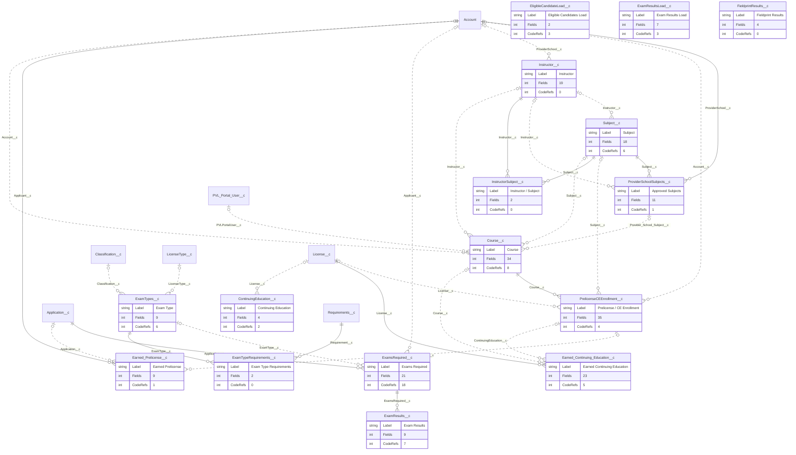

## Payments & Finance (16 objects)

Transactions, line items, PaymentConnect payments, fees, deposits and reconciliation.

```mermaid
erDiagram
    Account |o..o{ TransactionLine__c : "breg_Entity__c, Account__c"
    Account |o..o{ Transaction__c : "breg_Entity__c, Account__c"
    Account |o..o{ pymt__PaymentX__c : "pymt__Account__c"
    Application__c |o..o{ Transaction__c : "Application__c"
    BoardProgram__c |o..o{ CashierCode__c : "BoardProgram__c"
    Case |o..o{ TransactionLine__c : "breg_Refund_Case__c, breg_Case__c"
    Case |o..o{ Transaction__c : "breg_Case__c"
    Case |o..o{ pymt__PaymentX__c : "breg_Case__c"
    CashierCode__c |o..o{ LicenseTypeCashierCode__c : "CashierCode__c"
    CashierCode__c |o..o{ TransactionLine__c : "CashierCode__c"
    CertificateRequest__c |o..o{ Transaction__c : "CertificateRequest__c"
    Classification__c |o..o{ LicenseTypeCashierCode__c : "Classification__c"
    Contact |o..o{ TransactionLine__c : "breg_Delivery_Contact__c"
    Contact |o..o{ Transaction__c : "Contact__c"
    Contact |o..o{ pymt__PaymentX__c : "pymt__Contact__c"
    DFIRegistration__c |o..o{ Transaction__c : "DFIRegistration__c"
    Deposits__c |o..o{ CollectionsAllocation__c : "Deposit__c"
    Deposits__c |o..o{ pymt__PaymentX__c : "DepositBatch__c"
    FeeSchedule__c ||--o{ HardwareFees__c : "FeeSchedule__c"
    FeeSchedule__c ||--o{ ServicesFees__c : "FeeSchedule__c"
    FeeSchedule__c ||--o{ SoftwareFees__c : "FeeSchedule__c"
    FeeSchedule__c |o..o{ pymt__PaymentX__c : "FeeSchedule__c"
    Filing__c |o..o{ Transaction__c : "Filing__c"
    Filing__c |o..o{ pymt__PaymentX__c : "Filing__c"
    HPEAPRequest__c |o..o{ Transaction__c : "HPEAPRequest__c"
    LicenseType__c |o..o{ LicenseTypeCashierCode__c : "LicenseType__c"
    License__c |o..o{ Transaction__c : "License__c"
    Reconciliation_Batch__c |o..o{ CollectionsAllocation__c : "Reconciliation_Batch__c"
    SEBCase__c |o..o{ Transaction__c : "SEB_Case__c"
    Sanction_Payment__c |o..o{ Transaction__c : "Sanction_Payment__c"
    TransactionLine__c ||--o{ CollectionsAllocation__c : "TransactionLine__c"
    Transaction__c |o..o{ CollectionsAllocation__c : "Transaction__c"
    Transaction__c ||--o{ TransactionLine__c : "Transaction__c"
    Transaction__c |o..o{ Transaction__c : "TransactionGroup__c"
    Transaction__c |o..o{ pymt__PaymentX__c : "Transaction__c"
    breg_Agent_Search_List__c |o..o{ TransactionLine__c : "breg_Agent_Search_List__c"
    breg_Document__c |o..o{ TransactionLine__c : "breg_Document__c"
    breg_Entity_List__c |o..o{ TransactionLine__c : "breg_Entity_List__c"
    breg_Entity_List__c |o..o{ pymt__PaymentX__c : "breg_Entity_List__c"
    breg_Fee__c |o..o{ TransactionLine__c : "breg_Fee__c"
    cterminal__Terminal_Payment__c |o..o{ pymt__PaymentX__c : "TerminalPayment__c"
    pymt__Dispute__c |o..o{ pymt__PaymentX__c : "pymt__Dispute__c"
    pymt__PaymentX__c ||--o{ CollectionsAllocation__c : "Payment__c"
    pymt__PaymentX__c |o..o{ PaymentReconciliation__c : "RelatedPayment__c"
    pymt__PaymentX__c |o..o{ TransactionLine__c : "Payment__c"
    pymt__PaymentX__c |o..o{ pymt__PaymentX__c : "pymt__Parent_Transaction__c"
    pymt__Payment_Method__c |o..o{ pymt__PaymentX__c : "pymt__Payment_Method__c"
    pymt__Payment_Profile__c |o..o{ pymt__PaymentX__c : "pymt__Payment_Profile__c"
    pymt__Payout__c |o..o{ pymt__PaymentX__c : "pymt__Payout__c"
    pymt__Processor_Connection__c |o..o{ pymt__PaymentX__c : "pymt__Processor_Connection__c"
    CashierCode__c {
        string Label "Cashier Code"
        int Fields "14"
        int CodeRefs "44"
    }
    CollectionsAllocation__c {
        string Label "Collections Allocation"
        int Fields "31"
        int CodeRefs "25"
    }
    DFIRegistration__c {
        string Label "DFI Registration"
        int Fields "14"
        int CodeRefs "1"
    }
    Deposits__c {
        string Label "Deposits"
        int Fields "26"
        int CodeRefs "10"
    }
    FeeSchedule__c {
        string Label "Fee Schedule"
        int Fields "24"
        int CodeRefs "7"
    }
    FiscalForm__c {
        string Label "Fiscal Form"
        int Fields "8"
        int CodeRefs "5"
    }
    HPEAPRequest__c {
        string Label "HPEAP Request"
        int Fields "30"
        int CodeRefs "4"
    }
    HardwareFees__c {
        string Label "Hardware Fees"
        int Fields "4"
        int CodeRefs "1"
    }
    LicenseTypeCashierCode__c {
        string Label "License Type Cashier Code"
        int Fields "17"
        int CodeRefs "9"
    }
    PaymentReconciliation__c {
        string Label "Payment Reconciliation"
        int Fields "21"
        int CodeRefs "1"
    }
    Reconciliation_Batch__c {
        string Label "Reconciliation Batch"
        int Fields "11"
        int CodeRefs "9"
    }
    ServicesFees__c {
        string Label "Services Fees"
        int Fields "4"
        int CodeRefs "1"
    }
    SoftwareFees__c {
        string Label "Software Fees"
        int Fields "4"
        int CodeRefs "0"
    }
    TransactionLine__c {
        string Label "Transaction Line"
        int Fields "59"
        int CodeRefs "76"
    }
    Transaction__c {
        string Label "Transaction"
        int Fields "64"
        int CodeRefs "104"
    }
    pymt__PaymentX__c {
        string Label "Payment (PaymentConnect)"
        int Fields "193"
        int CodeRefs "83"
    }
```

## Securities: Filings & Exams (8 objects)

Securities registrations (broker-dealer, investment adviser, offerings) and compliance examinations.

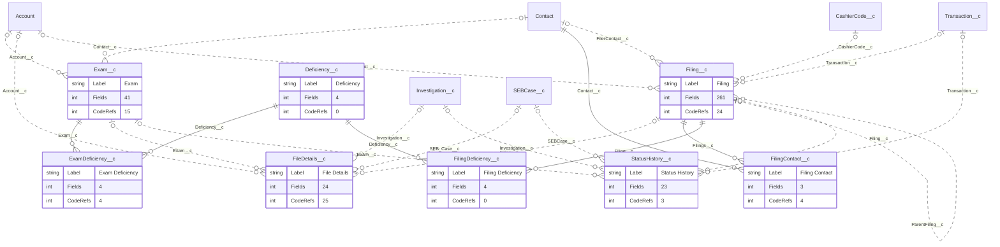

## Enforcement: SEB & RICO (19 objects)

Securities Enforcement Branch cases, investigations, sanctions and RICO referrals.

```mermaid
erDiagram
    Account |o..o{ SEBCaseContact__c : "Account__c"
    Account |o..o{ SEBCase__c : "Account__c"
    Allegation__c ||--o{ AllegationViolation__c : "Allegation__c"
    Case |o..o{ SEBCase__c : "DCCA_Case_Id__c"
    Contact |o..o{ SEBCaseContact__c : "Contact__c"
    Contact |o..o{ SEBCase__c : "Contact__c"
    Exam__c |o..o{ SEBCase__c : "ExamCaseReferral__c"
    Filing__c |o..o{ SEBCase__c : "Filing__c"
    Investigation__c |o..o{ Checklist__c : "Investigation__c"
    Investigation__c ||--o{ TimeandExpenseHeader__c : "Investigation__c"
    License__c |o..o{ RICOReferral__c : "License__c"
    RICOReferral__c ||--o{ RICOViolation__c : "RICOReferral__c"
    SEBCaseContact__c |o..o{ Allegation__c : "SEBCaseContact__c"
    SEBCaseContact__c ||--o{ EnforcementActionDocument__c : "SEBCaseContact__c"
    SEBCaseContact__c |o..o{ LegalAction__c : "SEBCaseContact__c"
    SEBCaseContact__c |o..o{ SEBCaseContact__c : "RelatedSEBCaseContact__c"
    SEBCaseContact__c |o..o{ Sanction__c : "SEBCaseContact__c"
    SEBCase__c ||--o{ Allegation__c : "SEBCaseID__c"
    SEBCase__c ||--o{ Investigation__c : "SEBCase__c"
    SEBCase__c ||--o{ LegalAction__c : "SEBCaseID__c"
    SEBCase__c ||--o{ ReferredFromAgencies__c : "SEBCase__c"
    SEBCase__c ||--o{ ReferredToAgencies__c : "SEBCase__c"
    SEBCase__c ||--o{ SEBCaseContact__c : "SEBCase__c"
    SEBCase__c |o..o{ SEBCaseNumber__c : "SEBCase__c"
    SEBCase__c ||--o{ SEBCaseTeam__c : "SEBCase__c"
    SEBCase__c |o..o{ SEBCase__c : "RelatedSEBCase__c"
    SEBCase__c ||--o{ Sanction__c : "SEBCaseID__c"
    Sanction__c ||--o{ Sanction_Payment__c : "Sanction__c"
    TimeandExpenseHeader__c ||--o{ TimeandExpenseDetails__c : "TimeandExpenseHeader__c"
    Violation__c ||--o{ AllegationViolation__c : "Violation__c"
    Violation__c |o..o{ RICOViolation__c : "Violation__c"
    AllegationViolation__c {
        string Label "Allegation Violation"
        int Fields "5"
        int CodeRefs "0"
    }
    Allegation__c {
        string Label "Allegation"
        int Fields "4"
        int CodeRefs "5"
    }
    Checklist__c {
        string Label "Checklist"
        int Fields "20"
        int CodeRefs "0"
    }
    EnforcementActionDocument__c {
        string Label "Enforcement Action Document"
        int Fields "4"
        int CodeRefs "2"
    }
    Investigation__c {
        string Label "Investigation"
        int Fields "40"
        int CodeRefs "17"
    }
    LegalAction__c {
        string Label "Legal Action"
        int Fields "8"
        int CodeRefs "5"
    }
    RICOReferral__c {
        string Label "RICO Referral"
        int Fields "28"
        int CodeRefs "1"
    }
    RICOViolation__c {
        string Label "RICO / Violation & Allegation"
        int Fields "8"
        int CodeRefs "0"
    }
    ReferredFromAgencies__c {
        string Label "Referred From Agencies"
        int Fields "3"
        int CodeRefs "0"
    }
    ReferredToAgencies__c {
        string Label "Referred To Agencies"
        int Fields "3"
        int CodeRefs "0"
    }
    SEBCaseContact__c {
        string Label "SEB Case Contact"
        int Fields "32"
        int CodeRefs "8"
    }
    SEBCaseNumber__c {
        string Label "SEB Case Number"
        int Fields "1"
        int CodeRefs "5"
    }
    SEBCaseTeam__c {
        string Label "SEB Case Team"
        int Fields "10"
        int CodeRefs "8"
    }
    SEBCase__c {
        string Label "SEB Case"
        int Fields "101"
        int CodeRefs "23"
    }
    Sanction_Payment__c {
        string Label "Sanction Payment"
        int Fields "9"
        int CodeRefs "3"
    }
    Sanction__c {
        string Label "Sanction"
        int Fields "26"
        int CodeRefs "9"
    }
    TimeandExpenseDetails__c {
        string Label "Time and Expense Details"
        int Fields "5"
        int CodeRefs "0"
    }
    TimeandExpenseHeader__c {
        string Label "Time and Expense Header"
        int Fields "7"
        int CodeRefs "4"
    }
    Violation__c {
        string Label "Violation"
        int Fields "4"
        int CodeRefs "4"
    }
```

## CATV / INET (5 objects)

Cable TV portal access requests and INET (Institutional Network) requests, quotes, POs and invoices.

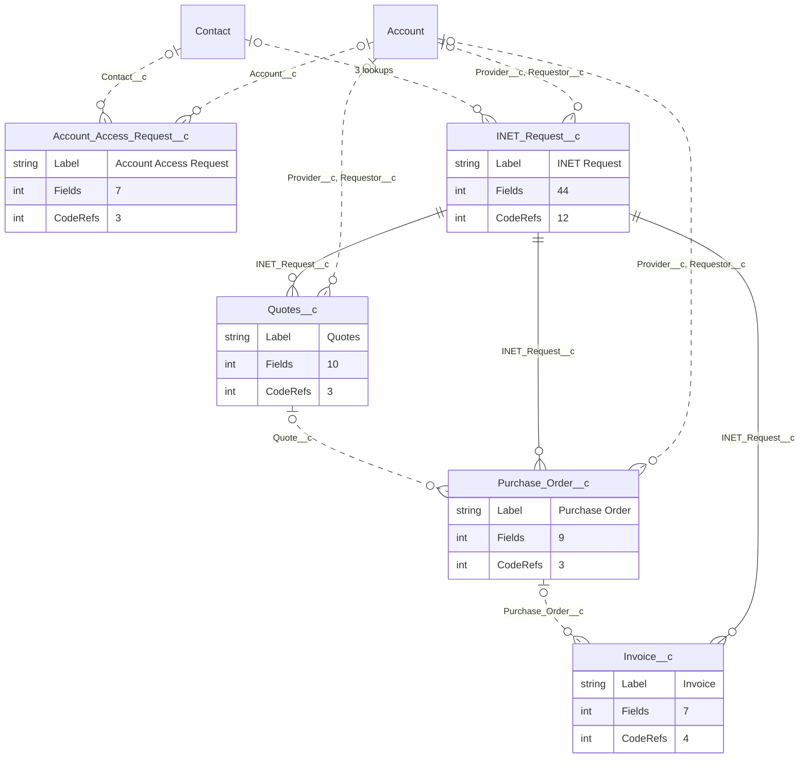

## Travel & Expense (2 objects)

Staff travel approval with expense worksheets (DocuSign approval).

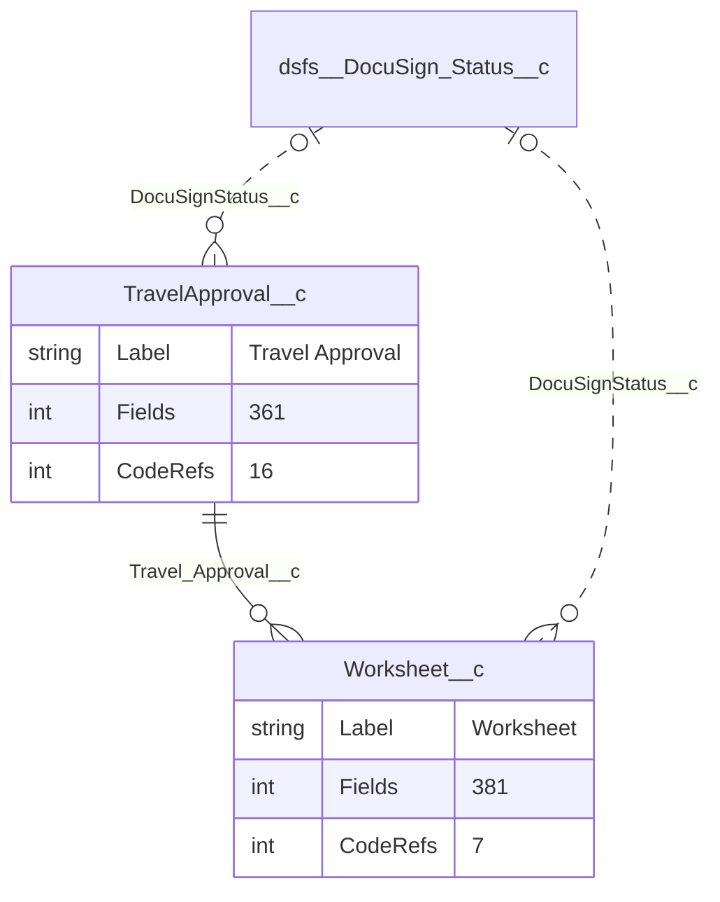

## Service & Work Management (13 objects)

Work items, case teams, internal IT tickets, Qualtrics logs, case auto-closer and alerts.

```mermaid
erDiagram
    Application__c |o..o{ Work_Item__c : "Application_Number__c"
    BoardProgram__c |o..o{ Work_Item__c : "Board_Program__c"
    Case ||--o{ CaseTeamAssignment__c : "Case__c"
    Case |o..o{ EmailAlertTrigger__c : "Case__c"
    Case |o..o{ Work_Item__c : "Case__c"
    Case |o..o{ qual_Integration_Log__c : "qual_Case__c"
    Case |o..o{ util_closer_Case_Log__c : "Case__c"
    CaseTeam__c ||--o{ CaseTeamMember__c : "CaseTeam__c"
    Contact |o..o{ EmailAlertTrigger__c : "Contact__c"
    Filing__c |o..o{ EmailAlertTrigger__c : "Filing__c"
    LicenseType__c |o..o{ Work_Item__c : "License_Type_PVL__c"
    License__c |o..o{ Work_Item__c : "License_Number_lu__c"
    UJET__UJET_Session__c |o..o{ Work_Item__c : "Voice_Call_Session__c"
    Work_Item__c |o..o{ Work_Item__c : "Transferred_From_Work_Item__c, Transferred_to_Work_Item__c"
    tkt_Ticket__c ||--o{ tkt_Ticket_Comment__c : "Ticket__c"
    util_closer_Batch_Log__c ||--o{ util_closer_Case_Log__c : "Batch_Log__c"
    BenefitManagementRecertification__c {
        string Label "Benefit Recertification Flow"
        int Fields "3"
        int CodeRefs "0"
    }
    CaseTeamAssignment__c {
        string Label "Case Team Assignment"
        int Fields "5"
        int CodeRefs "14"
    }
    CaseTeamMember__c {
        string Label "Case Team Member"
        int Fields "5"
        int CodeRefs "6"
    }
    CaseTeam__c {
        string Label "Case Team"
        int Fields "2"
        int CodeRefs "4"
    }
    EmailAlertTrigger__c {
        string Label "Email Alert Trigger"
        int Fields "8"
        int CodeRefs "3"
    }
    Knowledge__kav {
        string Label "Knowledge"
        int Fields "17"
        int CodeRefs "1"
    }
    Voice_Call_Session_Recording__c {
        string Label "Voice Call Session Recording"
        int Fields "2"
        int CodeRefs "0"
    }
    Work_Item__c {
        string Label "Work Item"
        int Fields "45"
        int CodeRefs "6"
    }
    qual_Integration_Log__c {
        string Label "Qualtrics Integration Log"
        int Fields "20"
        int CodeRefs "4"
    }
    tkt_Ticket_Comment__c {
        string Label "Ticket Comment"
        int Fields "5"
        int CodeRefs "4"
    }
    tkt_Ticket__c {
        string Label "Ticket"
        int Fields "17"
        int CodeRefs "7"
    }
    util_closer_Batch_Log__c {
        string Label "Batch Log"
        int Fields "16"
        int CodeRefs "6"
    }
    util_closer_Case_Log__c {
        string Label "Case Log"
        int Fields "16"
        int CodeRefs "4"
    }
```

## Object catalogue

| API name | Label | Domain | Type | Fields | Apex | LWC/Aura | Flows | Referenced by |
|---|---|---|---|---:|---:|---:|---:|---:|
| `Account` | Account | Core: Account · Contact · Case | Standard | 407 | 144 | 68 | 42 | 62 |
| `AccountName__c` | Account Name | PVL: Licenses & License Types | Custom object | 10 | 3 | 0 | 1 | 0 |
| `AccountSettings__c` | Account Settings | Configuration, Logs & Metadata | Custom object | 3 | 0 | 0 | 0 | 0 |
| `Account_Access_Request__c` | Account Access Request | CATV / INET | Custom object | 7 | 3 | 0 | 0 | 0 |
| `AdditionalDependentAppsLicenses__c` | Additional Dependent Apps / Licenses | PVL: Applications & Portal | Custom object | 5 | 0 | 0 | 0 | 0 |
| `AllegationViolation__c` | Allegation Violation | Enforcement: SEB & RICO | Custom object | 5 | 0 | 0 | 0 | 0 |
| `Allegation__c` | Allegation | Enforcement: SEB & RICO | Custom object | 4 | 1 | 0 | 4 | 1 |
| `ApplicationClassifications__c` | Application Classifications | PVL: Applications & Portal | Custom object | 12 | 17 | 1 | 8 | 0 |
| `ApplicationRequirement__c` | Application Requirement | PVL: Applications & Portal | Custom object | 15 | 12 | 1 | 3 | 1 |
| `Application_Cache__c` | Draft Application | PVL: Applications & Portal | Custom object | 26 | 17 | 0 | 0 | 2 |
| `Application_Log__c` | Application Log | PVL: Applications & Portal | Custom object | 12 | 5 | 0 | 1 | 0 |
| `Application_Meta_Data__c` | Application Meta Data | PVL: Applications & Portal | Custom object | 12 | 13 | 1 | 0 | 3 |
| `Application__c` | Application | PVL: Applications & Portal | Custom object | 443 | 103 | 6 | 68 | 17 |
| `ApprenticeApplicationCounter__c` | Apprentice Application Counter | PVL: Applications & Portal | Custom object | 2 | 1 | 0 | 0 | 0 |
| `AssociatedLicense__c` | Associated License | PVL: Licenses & License Types | Custom object | 50 | 51 | 1 | 24 | 2 |
| `Associated_Account__c` | Associated Account | PVL: Licenses & License Types | Custom object | 23 | 0 | 0 | 1 | 0 |
| `BREG_ADDRESS_PROTECTION__c` | ADDRESS PROTECTION | BREG: Business Registration | Custom object | 6 | 1 | 0 | 0 | 0 |
| `BREG_Annuals_Job_Settings__c` | DEPRECATED BREG Annuals Job Settings | Configuration, Logs & Metadata | Custom object | 3 | 1 | 0 | 0 | 0 |
| `BREG_Annuals_Rollover_Job_Settings__mdt` | BREG Annuals Rollover Job Setting | Configuration, Logs & Metadata | Custom metadata | 3 | 1 | 0 | 0 | 0 |
| `BREG_Batch_Job_Configuration__mdt` | BREG Batch Job Configuration | Configuration, Logs & Metadata | Custom metadata | 11 | 1 | 0 | 0 | 0 |
| `BREG_Batch_Setting__mdt` | BREG Batch Setting | Configuration, Logs & Metadata | Custom metadata | 5 | 1 | 0 | 0 | 0 |
| `BREG_Case_Owner_Reassignment__mdt` | BREG Case Owner Reassignment | Configuration, Logs & Metadata | Custom metadata | 2 | 1 | 0 | 0 | 0 |
| `BREG_Docusign_Templates_Setting__mdt` | BREG Docusign Templates Setting | Configuration, Logs & Metadata | Custom metadata | 2 | 3 | 0 | 0 | 0 |
| `BREG_File_Number_Sequence__c` | BREG File Number Sequence | BREG: Business Registration | Custom object | 2 | 1 | 0 | 0 | 0 |
| `BREG_Form_Setting__mdt` | BREG Form Setting | Configuration, Logs & Metadata | Custom metadata | 1 | 1 | 0 | 0 | 0 |
| `BREG_Handler_Error__e` | BREG Handler Error | Configuration, Logs & Metadata | Platform event | 5 | 3 | 0 | 0 | 0 |
| `BREG_MassEmailSettings__mdt` | BREG Mass Email Settings | Configuration, Logs & Metadata | Custom metadata | 3 | 1 | 0 | 0 | 0 |
| `BREG_Setting__c` | BREG Setting | Configuration, Logs & Metadata | Custom object | 26 | 25 | 2 | 19 | 0 |
| `BREG_Stamp_Setting__c` | BREG Stamp Setting | Configuration, Logs & Metadata | Custom object | 9 | 1 | 0 | 0 | 0 |
| `BREG_Stamp__mdt` | BREG Stamp | Configuration, Logs & Metadata | Custom metadata | 9 | 1 | 0 | 0 | 0 |
| `BatchJob_Setting__mdt` | BatchJob Settings | Configuration, Logs & Metadata | Custom metadata | 4 | 1 | 0 | 0 | 0 |
| `BenefitManagementRecertification__c` | Benefit Recertification Flow | Service & Work Management | Custom object | 3 | 0 | 0 | 0 | 0 |
| `BoardProgram__c` | Board / Program | PVL: Licenses & License Types | Custom object | 4 | 9 | 0 | 8 | 6 |
| `BusinessAccountCounter__c` | Business Account Counter | PVL: Licenses & License Types | Custom object | 2 | 2 | 0 | 0 | 0 |
| `Card_Cache__c` | Card Cache | PVL: Applications & Portal | Custom object | 6 | 9 | 0 | 0 | 0 |
| `Card_Meta_Data__c` | Card Meta Data | PVL: Applications & Portal | Custom object | 10 | 12 | 0 | 0 | 2 |
| `Case` | Case | Core: Account · Contact · Case | Standard | 512 | 170 | 71 | 102 | 32 |
| `CaseTeamAssignment__c` | Case Team Assignment | Service & Work Management | Custom object | 5 | 6 | 0 | 8 | 0 |
| `CaseTeamMember__c` | Case Team Member | Service & Work Management | Custom object | 5 | 2 | 0 | 4 | 0 |
| `CaseTeam__c` | Case Team | Service & Work Management | Custom object | 2 | 0 | 0 | 4 | 1 |
| `Case_Record_Type__mdt` | Case Record Type | Configuration, Logs & Metadata | Custom metadata | 2 | 0 | 0 | 1 | 0 |
| `CashierCode__c` | Cashier Code | Payments & Finance | Custom object | 14 | 26 | 3 | 15 | 4 |
| `CertificateRequest__c` | Certificate Request | PVL: Licenses & License Types | Custom object | 23 | 3 | 0 | 2 | 2 |
| `Checklist__c` | Checklist | Enforcement: SEB & RICO | Custom object | 20 | 0 | 0 | 0 | 0 |
| `Classification__c` | Classification | PVL: Licenses & License Types | Custom object | 8 | 21 | 2 | 6 | 5 |
| `CollectionsAllocation__c` | Collections Allocation | Payments & Finance | Custom object | 31 | 17 | 2 | 6 | 0 |
| `Contact` | Contact | Core: Account · Contact · Case | Standard | 117 | 50 | 24 | 19 | 18 |
| `ContinuingEducation__c` | Continuing Education | PVL: Exams & Continuing Education | Custom object | 4 | 1 | 0 | 1 | 0 |
| `Course__c` | Course | PVL: Exams & Continuing Education | Custom object | 34 | 6 | 0 | 2 | 2 |
| `CustomLogEvent__e` | Custom Log Event | Configuration, Logs & Metadata | Platform event | 8 | 1 | 0 | 0 | 0 |
| `CustomLogLevelSettings__c` | Custom Log Level Settings | Configuration, Logs & Metadata | Custom object | 2 | 1 | 0 | 0 | 0 |
| `CustomLog__c` | Custom Log | Configuration, Logs & Metadata | Custom object | 8 | 1 | 0 | 0 | 0 |
| `DFIRegistration__c` | DFI Registration | Payments & Finance | Custom object | 14 | 0 | 0 | 1 | 1 |
| `Deficiency__c` | Deficiency | Securities: Filings & Exams | Custom object | 4 | 0 | 0 | 0 | 2 |
| `Deposits__c` | Deposits | Payments & Finance | Custom object | 26 | 6 | 0 | 4 | 2 |
| `DocGeneratorDataSource__c` | Doc Generator Data Source | PVL: Licenses & License Types | Custom object | 9 | 4 | 0 | 0 | 0 |
| `DocGeneratorSettings__c` | Doc Generator Settings | PVL: Licenses & License Types | Custom object | 6 | 11 | 0 | 7 | 33 |
| `Earned_Continuing_Education__c` | Earned Continuing Education | PVL: Exams & Continuing Education | Custom object | 23 | 3 | 0 | 2 | 0 |
| `Earned_Prelicense__c` | Earned Prelicense | PVL: Exams & Continuing Education | Custom object | 9 | 0 | 0 | 1 | 0 |
| `Education__c` | Education | PVL: Applications & Portal | Custom object | 7 | 1 | 0 | 0 | 0 |
| `EligibleCandidateLoad__c` | Eligible Candidates Load | PVL: Exams & Continuing Education | Custom object | 2 | 3 | 0 | 0 | 0 |
| `EmailAlertEvent__e` | Email Alert Event | Configuration, Logs & Metadata | Platform event | 1 | 0 | 0 | 0 | 0 |
| `EmailAlertTrigger__c` | Email Alert Trigger | Service & Work Management | Custom object | 8 | 3 | 0 | 0 | 0 |
| `EmailAlertTypesToTemplate__mdt` | Email Alert Type To Template | Configuration, Logs & Metadata | Custom metadata | 2 | 0 | 0 | 0 | 0 |
| `EnforcementActionDocument__c` | Enforcement Action Document | Enforcement: SEB & RICO | Custom object | 4 | 1 | 0 | 1 | 0 |
| `ExamDeficiency__c` | Exam Deficiency | Securities: Filings & Exams | Custom object | 4 | 0 | 0 | 4 | 0 |
| `ExamResultsLoad__c` | Exam Results Load | PVL: Exams & Continuing Education | Custom object | 7 | 3 | 0 | 0 | 0 |
| `ExamResults__c` | Exam Results | PVL: Exams & Continuing Education | Custom object | 9 | 5 | 0 | 2 | 0 |
| `ExamTypeRequirements__c` | Exam Type Requirements | PVL: Exams & Continuing Education | Custom object | 2 | 0 | 0 | 0 | 0 |
| `ExamTypes__c` | Exam Type | PVL: Exams & Continuing Education | Custom object | 9 | 4 | 0 | 2 | 2 |
| `Exam__c` | Exam | Securities: Filings & Exams | Custom object | 41 | 11 | 0 | 4 | 4 |
| `ExamsRequired__c` | Exams Required | PVL: Exams & Continuing Education | Custom object | 21 | 7 | 0 | 11 | 1 |
| `Express_Change_Broker_History__c` | Express Change Broker History | PVL: Licenses & License Types | Custom object | 6 | 0 | 0 | 2 | 0 |
| `FeeSchedule__c` | Fee Schedule | Payments & Finance | Custom object | 24 | 6 | 0 | 1 | 4 |
| `Field_Filter__c` | Field Filter | PVL: Applications & Portal | Custom object | 14 | 6 | 0 | 0 | 1 |
| `Field_Meta_Data__c` | Field Meta Data | PVL: Applications & Portal | Custom object | 48 | 17 | 0 | 0 | 1 |
| `FieldprintResults__c` | Fieldprint Results | PVL: Exams & Continuing Education | Custom object | 4 | 0 | 0 | 0 | 0 |
| `FieldsperRecordType__mdt` | Fields per Record Type | Configuration, Logs & Metadata | Custom metadata | 7 | 1 | 0 | 0 | 0 |
| `FileDetails__c` | File Details | Securities: Filings & Exams | Custom object | 24 | 14 | 3 | 8 | 0 |
| `FilingContact__c` | Filing Contact | Securities: Filings & Exams | Custom object | 3 | 0 | 0 | 4 | 0 |
| `FilingDeficiency__c` | Filing Deficiency | Securities: Filings & Exams | Custom object | 4 | 0 | 0 | 0 | 0 |
| `Filing__c` | Filing | Securities: Filings & Exams | Custom object | 261 | 18 | 0 | 6 | 9 |
| `FiscalForm__c` | Fiscal Form | Payments & Finance | Custom object | 8 | 5 | 0 | 0 | 0 |
| `FlowSettings__c` | FlowSettings | Configuration, Logs & Metadata | Custom object | 5 | 0 | 0 | 3 | 0 |
| `FlowperRecordType__mdt` | Flow per Record Type | Configuration, Logs & Metadata | Custom metadata | 11 | 1 | 0 | 0 | 1 |
| `HPEAPRequest__c` | HPEAP Request | Payments & Finance | Custom object | 30 | 1 | 0 | 3 | 1 |
| `HardwareFees__c` | Hardware Fees | Payments & Finance | Custom object | 4 | 1 | 0 | 0 | 0 |
| `IMLCCSettings__c` | IMLCC | Configuration, Logs & Metadata | Custom object | 1 | 1 | 0 | 0 | 0 |
| `INET_Request__c` | INET Request | CATV / INET | Custom object | 44 | 4 | 4 | 4 | 3 |
| `IVR_Application_Status_Snapshot__c` | IVR Application Status Snapshot | PVL: Applications & Portal | Custom object | 12 | 4 | 0 | 0 | 0 |
| `Inspections__c` | Inspections | PVL: Licenses & License Types | Custom object | 5 | 0 | 0 | 0 | 0 |
| `InstructorSubject__c` | Instructor / Subject | PVL: Exams & Continuing Education | Custom object | 2 | 0 | 0 | 0 | 0 |
| `Instructor__c` | Instructor | PVL: Exams & Continuing Education | Custom object | 19 | 0 | 0 | 0 | 4 |
| `InsuranceBond__c` | Insurance & Bond | PVL: Licenses & License Types | Custom object | 33 | 21 | 0 | 7 | 1 |
| `InsurancePortalSubmission__c` | Insurance Portal Submission | PVL: Licenses & License Types | Custom object | 36 | 4 | 0 | 1 | 0 |
| `Insurer__c` | Insurer | PVL: Licenses & License Types | Custom object | 4 | 0 | 0 | 0 | 0 |
| `Investigation__c` | Investigation | Enforcement: SEB & RICO | Custom object | 40 | 9 | 0 | 8 | 4 |
| `Invoice__c` | Invoice | CATV / INET | Custom object | 7 | 1 | 2 | 1 | 0 |
| `Knowledge__kav` | Knowledge | Service & Work Management | Knowledge | 17 | 1 | 0 | 0 | 0 |
| `LegalAction__c` | Legal Action | Enforcement: SEB & RICO | Custom object | 8 | 1 | 0 | 4 | 0 |
| `LicenseClassification__c` | License Classification | PVL: Licenses & License Types | Custom object | 15 | 27 | 0 | 10 | 0 |
| `LicenseConditions__c` | License Condition | PVL: Licenses & License Types | Custom object | 8 | 8 | 0 | 0 | 1 |
| `LicenseHistory__c` | License History | PVL: Licenses & License Types | Custom object | 65 | 19 | 0 | 18 | 0 |
| `LicenseName__c` | License Name | PVL: Licenses & License Types | Custom object | 9 | 3 | 0 | 5 | 0 |
| `LicenseNumberAssignment__mdt` | License Number Assignment | Configuration, Logs & Metadata | Custom metadata | 3 | 1 | 0 | 0 | 0 |
| `LicenseNumberAssignments__c` | License Number Assignments | PVL: Licenses & License Types | Custom object | 4 | 3 | 0 | 0 | 0 |
| `LicensePeriod__c` | License Period | PVL: Licenses & License Types | Custom object | 7 | 22 | 0 | 22 | 0 |
| `LicenseRequirements__c` | License Requirements | PVL: Licenses & License Types | Custom object | 10 | 9 | 0 | 1 | 1 |
| `LicenseTypeCashierCode__c` | License Type Cashier Code | Payments & Finance | Custom object | 17 | 5 | 0 | 4 | 0 |
| `LicenseTypeMapping__c` | License Type Mapping | PVL: Licenses & License Types | Custom object | 4 | 0 | 0 | 1 | 0 |
| `LicenseTypeRequirements__c` | License Type Requirement | PVL: Licenses & License Types | Custom object | 22 | 6 | 0 | 0 | 0 |
| `LicenseTypeSetting__mdt` | LicenseTypeSetting | Configuration, Logs & Metadata | Custom metadata | 1 | 1 | 0 | 0 | 0 |
| `LicenseType_Required_CE__c` | License Type / Education Subjects | PVL: Licenses & License Types | Custom object | 5 | 1 | 0 | 0 | 0 |
| `LicenseType__c` | License Type | PVL: Licenses & License Types | Custom object | 245 | 77 | 4 | 17 | 18 |
| `License_REST_API_Setting__mdt` | License REST API Setting | Configuration, Logs & Metadata | Custom metadata | 5 | 1 | 0 | 0 | 0 |
| `License__c` | License | PVL: Licenses & License Types | Custom object | 501 | 123 | 5 | 66 | 43 |
| `MakeandSupplier__c` | Make and Supplier | PVL: Licenses & License Types | Custom object | 6 | 0 | 0 | 0 | 0 |
| `NewBatchTransactionComponentConfig__mdt` | New Batch Transaction Component Config | Configuration, Logs & Metadata | Custom metadata | 4 | 1 | 0 | 0 | 0 |
| `Notification__c` | Notification | PVL: Licenses & License Types | Custom object | 33 | 35 | 0 | 9 | 1 |
| `ObjectPrefix__mdt` | ObjectPrefix | Configuration, Logs & Metadata | Custom metadata | 2 | 0 | 0 | 1 | 0 |
| `OrgConfiguration__c` | Org Configuration | Configuration, Logs & Metadata | Custom object | 11 | 26 | 0 | 0 | 0 |
| `Org_Credential__mdt` | Org Credential | Configuration, Logs & Metadata | Custom metadata | 2 | 1 | 0 | 0 | 0 |
| `OtherStateLicenses__c` | Other State Licenses | PVL: Applications & Portal | Custom object | 7 | 1 | 0 | 0 | 0 |
| `PVLErrorHandler__e` | PVL Error Handler | Configuration, Logs & Metadata | Platform event | 6 | 2 | 0 | 0 | 0 |
| `PVLProcess__e` | PVL Process | Configuration, Logs & Metadata | Platform event | 2 | 15 | 0 | 2 | 0 |
| `PVLRenewalSettings__c` | PVL Renewal Settings | Configuration, Logs & Metadata | Custom object | 1 | 1 | 0 | 0 | 0 |
| `PVLScanningComponent__mdt` | PVL Scanning Component | Configuration, Logs & Metadata | Custom metadata | 6 | 4 | 0 | 0 | 0 |
| `PVLSettings__mdt` | PVL Settings | Configuration, Logs & Metadata | Custom metadata | 3 | 3 | 0 | 0 | 0 |
| `PVL_Board_Assignment__c` | Work Item Assignment | PVL: Applications & Portal | Custom object | 8 | 0 | 0 | 3 | 0 |
| `PVL_Express_Change_Broker_Form__c` | Express Change Broker | PVL: Licenses & License Types | Custom object | 41 | 0 | 0 | 3 | 1 |
| `PVL_Portal_Persona__c` | PVL Portal Persona | PVL: Applications & Portal | Custom object | 2 | 0 | 0 | 0 | 0 |
| `PVL_Portal_User__c` | PVL Portal User | PVL: Applications & Portal | Custom object | 22 | 6 | 0 | 6 | 7 |
| `PVL_Portal__c` | PVL Portal | PVL: Applications & Portal | Custom object |  | 0 | 0 | 0 | 1 |
| `Partner_Officer__c` | Partner/Officer | PVL: Applications & Portal | Custom object | 6 | 0 | 0 | 0 | 0 |
| `PaymentReconciliation__c` | Payment Reconciliation | Payments & Finance | Custom object | 21 | 0 | 0 | 1 | 0 |
| `PicklistForRecordType__mdt` | Picklist For Record Type | Configuration, Logs & Metadata | Custom metadata | 4 | 1 | 0 | 0 | 0 |
| `PrelicenseCEEnrollment__c` | Prelicense / CE Enrollment | PVL: Exams & Continuing Education | Custom object | 35 | 2 | 0 | 2 | 2 |
| `ProcessSwitches__c` | Process Switches | Configuration, Logs & Metadata | Custom object | 31 | 1 | 0 | 0 | 0 |
| `ProviderSchoolSubjects__c` | Approved Subjects | PVL: Exams & Continuing Education | Custom object | 11 | 1 | 0 | 0 | 1 |
| `PublicGroupPermissionMapping__mdt` | Public Group Permission Mapping | Configuration, Logs & Metadata | Custom metadata | 2 | 2 | 0 | 0 | 0 |
| `Purchase_Order__c` | Purchase Order | CATV / INET | Custom object | 9 | 1 | 2 | 0 | 1 |
| `Quotes__c` | Quotes | CATV / INET | Custom object | 10 | 1 | 2 | 0 | 1 |
| `RICOReferral__c` | RICO Referral | Enforcement: SEB & RICO | Custom object | 28 | 0 | 0 | 1 | 1 |
| `RICOViolation__c` | RICO / Violation & Allegation | Enforcement: SEB & RICO | Custom object | 8 | 0 | 0 | 0 | 0 |
| `Reconciliation_Batch__c` | Reconciliation Batch | Payments & Finance | Custom object | 11 | 7 | 0 | 2 | 1 |
| `ReferredFromAgencies__c` | Referred From Agencies | Enforcement: SEB & RICO | Custom object | 3 | 0 | 0 | 0 | 0 |
| `ReferredToAgencies__c` | Referred To Agencies | Enforcement: SEB & RICO | Custom object | 3 | 0 | 0 | 0 | 0 |
| `RenewalScanningResults__c` | Renewal Scanning Results | PVL: Licenses & License Types | Custom object | 4 | 5 | 0 | 0 | 0 |
| `Requirements__c` | Requirement | PVL: Licenses & License Types | Custom object | 8 | 5 | 0 | 0 | 5 |
| `Requisition__c` | Requisition | PVL: Applications & Portal | Custom object | 34 | 0 | 0 | 5 | 0 |
| `SEBCaseContact__c` | SEB Case Contact | Enforcement: SEB & RICO | Custom object | 32 | 1 | 0 | 7 | 5 |
| `SEBCaseNumber__c` | SEB Case Number | Enforcement: SEB & RICO | Custom object | 1 | 1 | 1 | 3 | 0 |
| `SEBCaseTeam__c` | SEB Case Team | Enforcement: SEB & RICO | Custom object | 10 | 2 | 0 | 6 | 0 |
| `SEBCase__c` | SEB Case | Enforcement: SEB & RICO | Custom object | 101 | 10 | 0 | 13 | 13 |
| `Sanction_Payment__c` | Sanction Payment | Enforcement: SEB & RICO | Custom object | 9 | 2 | 0 | 1 | 1 |
| `Sanction__c` | Sanction | Enforcement: SEB & RICO | Custom object | 26 | 5 | 0 | 4 | 1 |
| `Send_Letter_to_Printer__mdt` | Send Letter to Printer | Configuration, Logs & Metadata | Custom metadata | 2 | 1 | 0 | 0 | 0 |
| `Send_to_4Gov_Email_Setting__mdt` | Send to 4Gov Email Setting | Configuration, Logs & Metadata | Custom metadata | 3 | 1 | 0 | 0 | 0 |
| `ServicesFees__c` | Services Fees | Payments & Finance | Custom object | 4 | 1 | 0 | 0 | 0 |
| `SoftwareFees__c` | Software Fees | Payments & Finance | Custom object | 4 | 0 | 0 | 0 | 0 |
| `SpringCLMSetting__mdt` | Spring CLM Setting | Configuration, Logs & Metadata | Custom metadata | 5 | 6 | 0 | 0 | 0 |
| `SpringCLM_Session__c` | SpringCLM Session | Configuration, Logs & Metadata | Custom object | 2 | 1 | 0 | 0 | 0 |
| `SpringCMApiEnvironment__mdt` | SpringCMApiEnvironment | Configuration, Logs & Metadata | Custom metadata | 3 | 0 | 0 | 0 | 0 |
| `StatusHistory__c` | Status History | Securities: Filings & Exams | Custom object | 23 | 3 | 0 | 0 | 0 |
| `Subject__c` | Subject | PVL: Exams & Continuing Education | Custom object | 18 | 3 | 1 | 2 | 5 |
| `Suspense__c` | Suspense | PVL: Licenses & License Types | Custom object | 13 | 12 | 0 | 5 | 0 |
| `TaxClearanceApi__c` | TaxClearanceApi | Configuration, Logs & Metadata | Custom object | 3 | 1 | 0 | 0 | 0 |
| `TimeandExpenseDetails__c` | Time and Expense Details | Enforcement: SEB & RICO | Custom object | 5 | 0 | 0 | 0 | 0 |
| `TimeandExpenseHeader__c` | Time and Expense Header | Enforcement: SEB & RICO | Custom object | 7 | 2 | 0 | 2 | 1 |
| `TransactionLine__c` | Transaction Line | Payments & Finance | Custom object | 59 | 45 | 2 | 29 | 1 |
| `Transaction__c` | Transaction | Payments & Finance | Custom object | 64 | 61 | 10 | 33 | 7 |
| `TravelApproval__c` | Travel Approval | Travel & Expense | Custom object | 361 | 4 | 0 | 12 | 1 |
| `UploadedFilesperRecordType__mdt` | Uploaded Files per Record Type | Configuration, Logs & Metadata | Custom metadata | 10 | 1 | 0 | 0 | 0 |
| `Violation__c` | Violation | Enforcement: SEB & RICO | Custom object | 4 | 0 | 0 | 4 | 2 |
| `Voice_Call_Session_Recording__c` | Voice Call Session Recording | Service & Work Management | Custom object | 2 | 0 | 0 | 0 | 0 |
| `Work_Item_Routing__mdt` | Work Item Routing | Configuration, Logs & Metadata | Custom metadata | 7 | 0 | 0 | 4 | 0 |
| `Work_Item__c` | Work Item | Service & Work Management | Custom object | 45 | 0 | 0 | 6 | 2 |
| `Worksheet__c` | Worksheet | Travel & Expense | Custom object | 381 | 0 | 0 | 7 | 0 |
| `breg_Account_Affiliation__c` | Account Affiliation | BREG: Business Registration | Custom object | 53 | 43 | 7 | 5 | 4 |
| `breg_Acquisition_Transaction__c` | Acquisition Transaction | BREG: Business Registration | Custom object | 11 | 0 | 0 | 0 | 0 |
| `breg_Agent_Search_List__c` | Agent Search List | BREG: Business Registration | Custom object | 9 | 4 | 0 | 1 | 2 |
| `breg_Agent_Search_Result__c` | Agent Search Result | BREG: Business Registration | Custom object | 4 | 1 | 0 | 0 | 0 |
| `breg_Annual__c` | Annual | BREG: Business Registration | Custom object | 26 | 24 | 4 | 8 | 2 |
| `breg_BRIM_Transaction_Event__b` | Transaction Event | BREG: Business Registration | Big object | 9 | 0 | 0 | 0 | 0 |
| `breg_Batch_Job_Execution__c` | Batch Job Execution | BREG: Business Registration | Custom object | 16 | 8 | 0 | 0 | 0 |
| `breg_Case_Staging__c` | Case Staging | BREG: Business Registration | Custom object | 12 | 3 | 0 | 0 | 0 |
| `breg_Certificate__c` | Certificate | BREG: Business Registration | Custom object | 17 | 7 | 0 | 1 | 4 |
| `breg_Company_Info_Field_Mapping__mdt` | Company Info Field Mapping | Configuration, Logs & Metadata | Custom metadata | 7 | 1 | 0 | 0 | 0 |
| `breg_DBEDT_Report__c` | DBEDT Report | BREG: Business Registration | Custom object | 8 | 1 | 0 | 0 | 0 |
| `breg_DocuSign_Auth__mdt` | BREG DocuSign Auth | Configuration, Logs & Metadata | Custom metadata | 9 | 1 | 0 | 0 | 0 |
| `breg_Document__c` | Document | BREG: Business Registration | Custom object | 32 | 25 | 1 | 4 | 6 |
| `breg_Docusign_Settings__c` | Docusign Settings | Configuration, Logs & Metadata | Custom object | 8 | 4 | 0 | 0 | 0 |
| `breg_Email_Log__c` | Email Log | BREG: Business Registration | Custom object | 3 | 1 | 0 | 1 | 0 |
| `breg_Entity_List_Item__c` | Entity List Item | BREG: Business Registration | Custom object | 1 | 0 | 0 | 0 | 0 |
| `breg_Entity_List_Result__c` | Entity List Result | BREG: Business Registration | Custom object | 8 | 5 | 0 | 0 | 0 |
| `breg_Entity_List__c` | Entity List | BREG: Business Registration | Custom object | 14 | 5 | 0 | 1 | 4 |
| `breg_Fee__c` | Fee | BREG: Business Registration | Custom object | 18 | 8 | 0 | 0 | 2 |
| `breg_Form_Configuration_Item__c` | Form Configuration Item | BREG: Business Registration | Custom object | 16 | 4 | 1 | 0 | 1 |
| `breg_Form_Configuration__c` | Form Configuration | BREG: Business Registration | Custom object | 36 | 16 | 4 | 7 | 5 |
| `breg_Log__c` | Log | BREG: Business Registration | Custom object | 16 | 2 | 0 | 1 | 0 |
| `breg_Notification_Category__mdt` | Notification Category | Configuration, Logs & Metadata | Custom metadata | 6 | 1 | 0 | 4 | 0 |
| `breg_Notification__c` | Notification | BREG: Business Registration | Custom object | 14 | 2 | 0 | 5 | 0 |
| `breg_RDPMS_Adhoc_Request__c` | RDPMS Adhoc Request | BREG: Business Registration | Custom object | 6 | 1 | 0 | 2 | 1 |
| `breg_Rejection_Reason__c` | Rejection Reason | BREG: Business Registration | Custom object | 4 | 0 | 0 | 1 | 0 |
| `breg_Search_Log__c` | BREG Search Log | BREG: Business Registration | Custom object | 12 | 3 | 0 | 0 | 0 |
| `breg_Stock__c` | Stock | BREG: Business Registration | Custom object | 21 | 15 | 5 | 0 | 0 |
| `breg_TN_TM_SM__c` | TN/TM/SM | BREG: Business Registration | Custom object | 53 | 34 | 5 | 10 | 6 |
| `breg_Test_Annual__c` | Test Annual | BREG: Business Registration | Custom object | 20 | 1 | 0 | 0 | 0 |
| `breg_Transaction_Address__c` | BREG Transaction Address | BREG: Business Registration | Custom object | 19 | 5 | 0 | 0 | 0 |
| `breg_Transaction_Business_Info__c` | Transaction Business Info | BREG: Business Registration | Custom object | 49 | 5 | 0 | 0 | 0 |
| `breg_Transaction__c` | BREG Transaction | BREG: Business Registration | Custom object | 46 | 28 | 0 | 5 | 19 |
| `breg_WEB_WEB_ADDRESSES__c` | WEB ADDRESSES | BREG: Legacy Web Filing Staging | Custom object | 23 | 2 | 0 | 0 | 0 |
| `breg_WEB_WEB_BUSINESS_INFO__c` | WEB BUSINESS INFO | BREG: Legacy Web Filing Staging | Custom object | 45 | 1 | 0 | 0 | 0 |
| `breg_WEB_WEB_FILING_INFO__c` | WEB FILING INFO | BREG: Legacy Web Filing Staging | Custom object | 37 | 7 | 0 | 1 | 0 |
| `breg_WEB_WEB_FILING_YEARS__c` | WEB FILING YEARS | BREG: Legacy Web Filing Staging | Custom object | 18 | 0 | 0 | 0 | 0 |
| `breg_WEB_WEB_PERSONS__c` | WEB PERSONS | BREG: Legacy Web Filing Staging | Custom object | 38 | 1 | 0 | 0 | 0 |
| `breg_WEB_WEB_RESUB__c` | WEB RESUB | BREG: Legacy Web Filing Staging | Custom object | 4 | 0 | 0 | 0 | 0 |
| `breg_WEB_WEB_STOCKS__c` | WEB STOCKS | BREG: Legacy Web Filing Staging | Custom object | 19 | 1 | 0 | 0 | 0 |
| `breg_WEB_WEB_TRADE_MARKS__c` | WEB TRADE MARKS | BREG: Legacy Web Filing Staging | Custom object | 26 | 1 | 0 | 0 | 0 |
| `fflibe_Domain__mdt` | fflibe Domain | Configuration, Logs & Metadata | Custom metadata | 2 | 1 | 0 | 0 | 0 |
| `fflibe_Selector__mdt` | fflibe Selector | Configuration, Logs & Metadata | Custom metadata | 2 | 1 | 0 | 0 | 0 |
| `ppt_Toast__e` | Toast Event | Configuration, Logs & Metadata | Platform event | 5 | 0 | 1 | 2 | 0 |
| `pymt__PaymentX__c` | Payment (PaymentConnect) | Payments & Finance | Managed package | 193 | 55 | 0 | 28 | 5 |
| `qual_Config__mdt` | Qualtrics Config | Configuration, Logs & Metadata | Custom metadata | 28 | 10 | 0 | 0 | 0 |
| `qual_Integration_Log__c` | Qualtrics Integration Log | Service & Work Management | Custom object | 20 | 4 | 0 | 0 | 0 |
| `qual_Integration_Settings__c` | Qualtrics Integration Settings | Configuration, Logs & Metadata | Custom object | 2 | 1 | 0 | 0 | 0 |
| `tkt_Email_Notification_Setting__mdt` | Ticket Email Notification Setting | Configuration, Logs & Metadata | Custom metadata | 9 | 1 | 0 | 0 | 0 |
| `tkt_Email_Settings__mdt` | Ticket Email Settings | Configuration, Logs & Metadata | Custom metadata | 6 | 1 | 0 | 0 | 0 |
| `tkt_Ticket_Comment__c` | Ticket Comment | Service & Work Management | Custom object | 5 | 4 | 0 | 0 | 0 |
| `tkt_Ticket_Routing_Rule__mdt` | Ticket Routing Rule | Configuration, Logs & Metadata | Custom metadata | 7 | 1 | 0 | 0 | 0 |
| `tkt_Ticket_Sharing_Group__mdt` | Ticket Sharing Group | Configuration, Logs & Metadata | Custom metadata | 3 | 1 | 0 | 0 | 0 |
| `tkt_Ticket__c` | Ticket | Service & Work Management | Custom object | 17 | 6 | 1 | 0 | 1 |
| `tkt_Trigger_Control__c` | Ticket Trigger Control | Configuration, Logs & Metadata | Custom object | 2 | 2 | 0 | 0 | 0 |
| `util_closer_Batch_Log__c` | Batch Log | Service & Work Management | Custom object | 16 | 5 | 1 | 0 | 1 |
| `util_closer_Case_Log__c` | Case Log | Service & Work Management | Custom object | 16 | 4 | 0 | 0 | 0 |
| `util_closer_Case_Status_Rule__mdt` | Case Status Rule | Configuration, Logs & Metadata | Custom metadata | 24 | 5 | 0 | 0 | 0 |
| `util_closer_Settings__c` | Case Auto-Closer Settings | Configuration, Logs & Metadata | Custom object | 13 | 2 | 0 | 0 | 0 |
